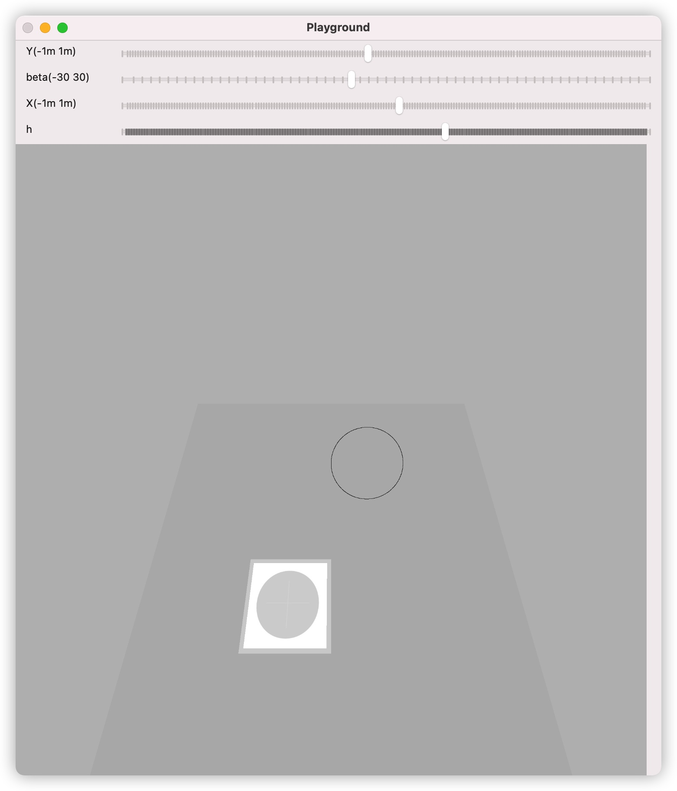

# Virtual-Camera

Simulate a camera model, based on Python and Numpy

## Introduction

Though the camera model is well studied, I can't find a clear implimentation of python. So I wrote this for learning and fun.

It follows the intuitive procedure to map the point from one space to another.

You can set the focal length, image resolution and its pose (RPY and XYZ) (in World coordinates).

## Environment

Python 3

Numpy

## Usage

The core model is the VirtualCamera class in virtual_camera.py

You just need to

1. initiate a camera instance
2. Use the camera to project some points in world space to the pixel space

## Playground

I write a simple GUI example to show how the code works, and you can play with it. 

Try to move the trackbar and make the projected circle match the image!